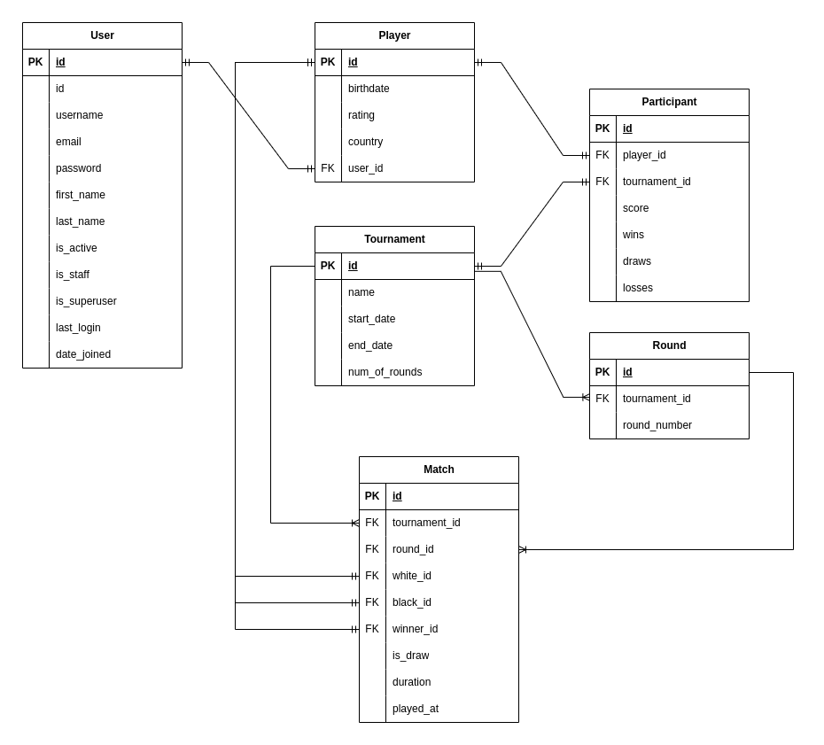

# chessphere
## Chess Tournament management system (simulation) written in Django and Django REST framework. 

## Table of Contents
- [Installation](#installation)
- [Database Design](#database-design)
- [Explanation](#explanation)

## Installation
1. Clone the repo:
    ```sh
    git clone https://github.com/Samandar-Komilov/chessphere.git
    ```
2. Navigate to the project directory:
    ```sh
    cd chessphere
    ```
3. Initiate a virtual environment (pipenv):
    ```sh
    pipenv shell
    ```
3. Install dependencies:
    ```sh
    pipenv install -r requirements.txt
    ```
4. Create .env file and specify your postgres database credentials:
    ```.env
    DB_NAME = <your_db_name>
    DB_USER = <your_db_user>
    DB_PASSWORD = <your_db_password>
    DB_HOST = <your_db_host>
    ```
5. Migrate database:
    ```sh
    python manage.py makemigrations
    python manage.py migrate
    ```
6. Run the project:
    ```sh
    python manage.py runserver
    ```

## Database Design



## Explanation
The app consists of the following functionalities:
- User authentication (JWT based)
- User management by admins
- Tournaments management by admins
- Participants management by admins

### Users and Players
There is a separate `Player` model which represents players and is linked to `User` model as OneToOne relationship. (This method is considered as better approach to extend default `User` model). When a user registers, a corresponding `Player` object will be created too. Admins can create new users and players, change their data and delete them. 

### Tournaments
Admins can create, update and delete tournaments. They contain a certain number of participants, which are independent models from `Player`. This is because, there are many tournaments and a single player can attend multiple ones with distinct statistics. Hence, I used `Participant` model to represent that instance. Admins and registered users can see a list of participants to a tournament.

### Rounds
A `Tournament` instance consists of `num_of_rounds` field - certain number of rounds (from 1 to 11 in this case). When a new tournament is created, that number of `Round` objects are created automatically. But once created, the `num_of_rounds` field cannot be changed even by admins.

### Matches
`Match` objects represent pairings and their results per round. They contain foreign keys to black and white players and the winner between them. If draw occurs, winner will be `None` and draw flag become `True`. This is crucial to represent their stats in W/D/L form.

### Simulation
Using Python's built-in `random` module, we can simulate the whole tournament and its results. I implemented that functionality in `simulate_tournament.py` file using pure Python objects. The simulation:
- pairs players for each round
- randomly choose the match result
- lists all pairings for each round
- lists the leaderboard for each round
Soon, I'll implement this functionality in django too, just it is a matter of time. 

### Idea
But the idea is:
- `/tournament/<int:pk>/generate-pairings/` endpoint is responsible to generate all pairings for all rounds. Each pairing represent a `Match` object with a random result. So, for example, a tournament with 3 rounds and 10 participants will generate 5×3=15 `Match` objects. We can access the corresponding rounds and matches using their ids, like:
- `/tournaments/<int:pk>/rounds/<int:pk>/match/<match_id>/`

